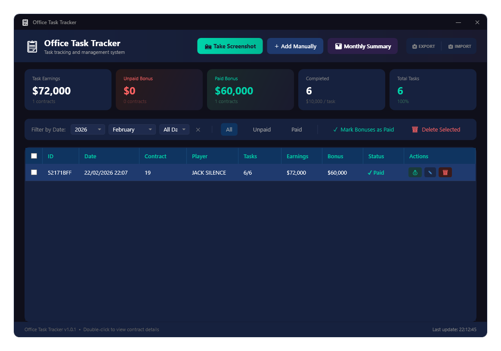
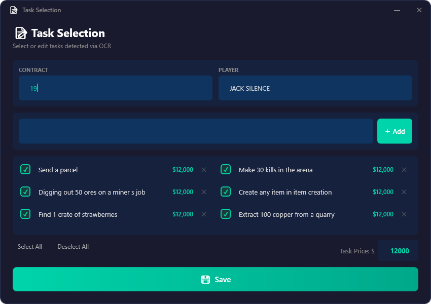
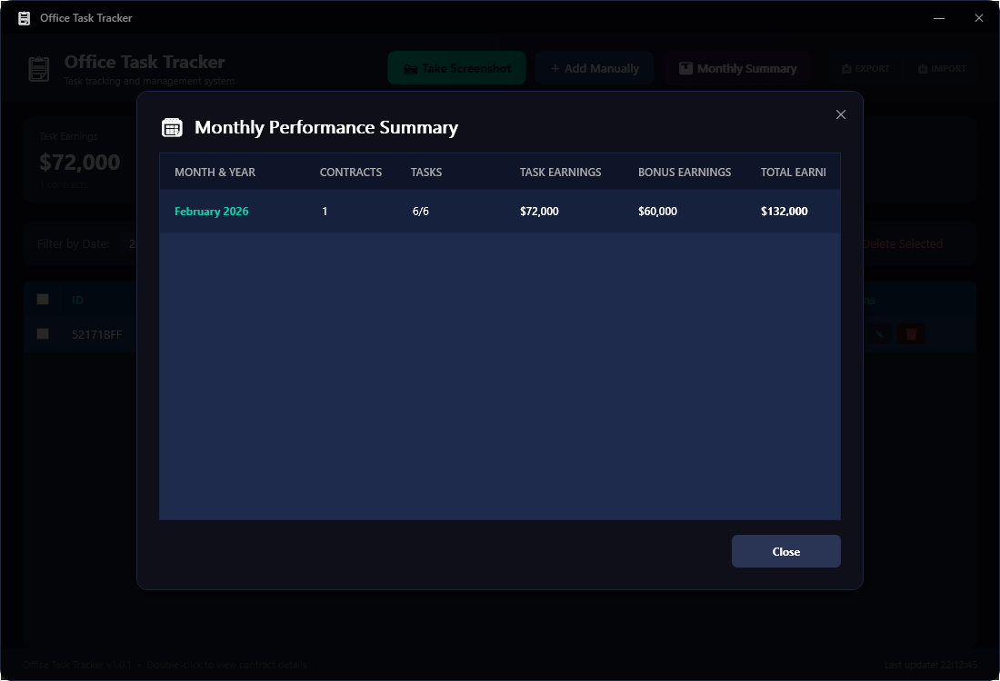
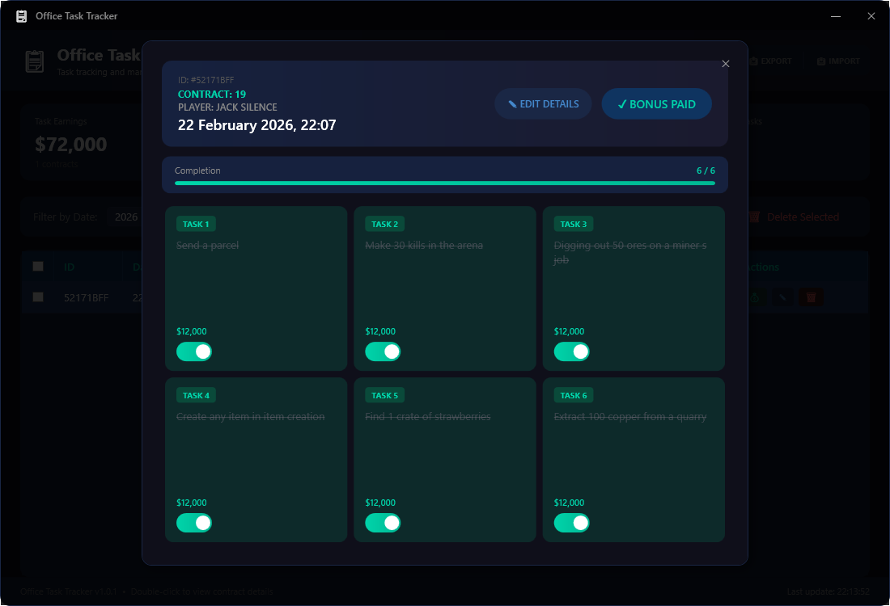

# Grand RP EN Office Task Tracker

### Quick Start
1.  Open your **Office Contract** on the screen.
2.  Press the **📸 Take Screenshot** button in the app.
3.  Select the task area to automatically detect and log your work.

### Screenshots

  
  
  

---
*All data is saved locally and can be managed via the dashboard.*
